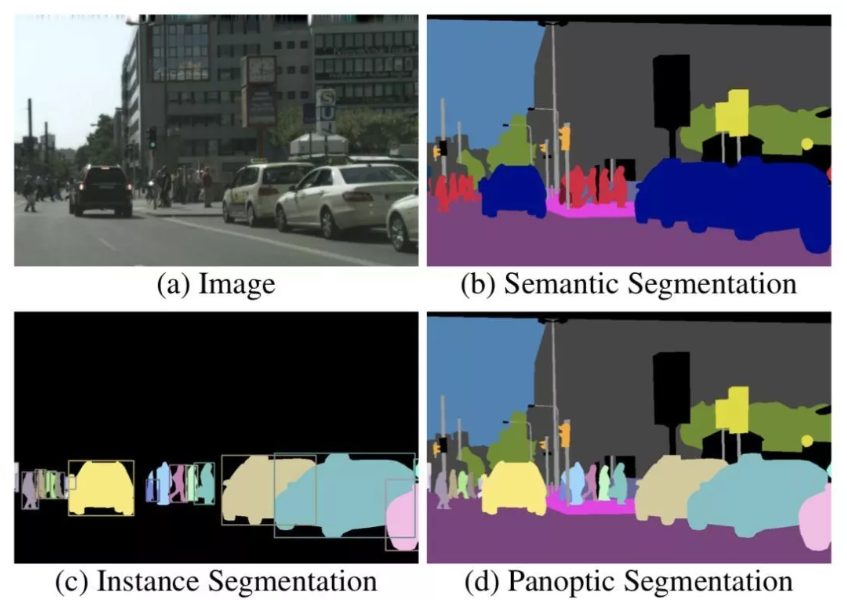
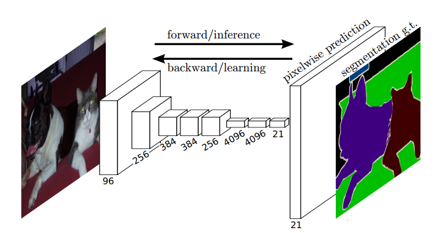
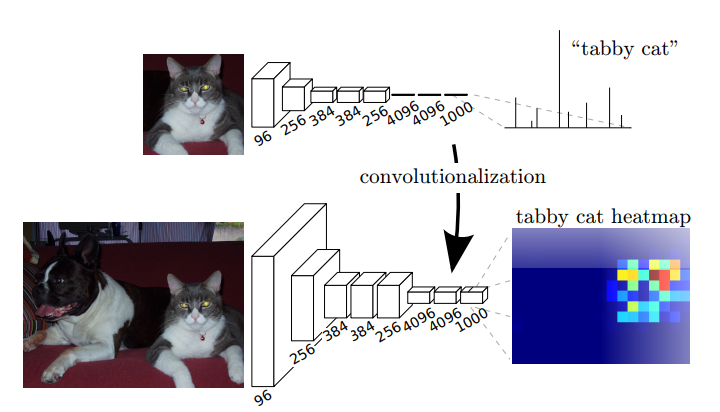
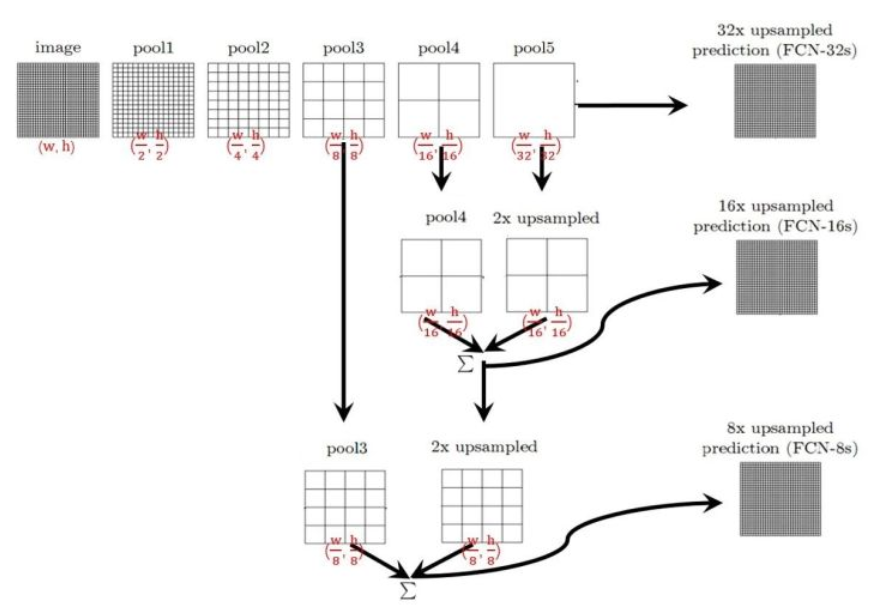
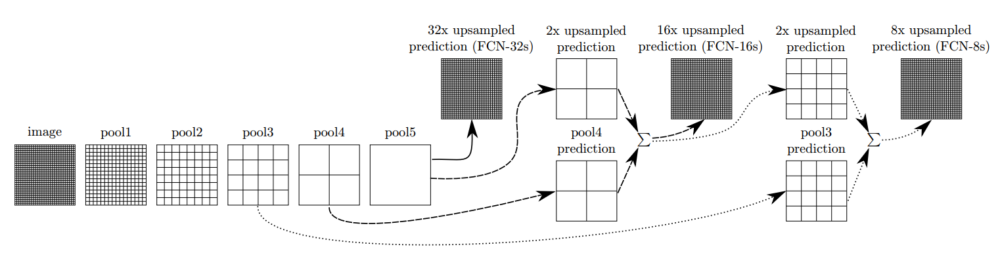
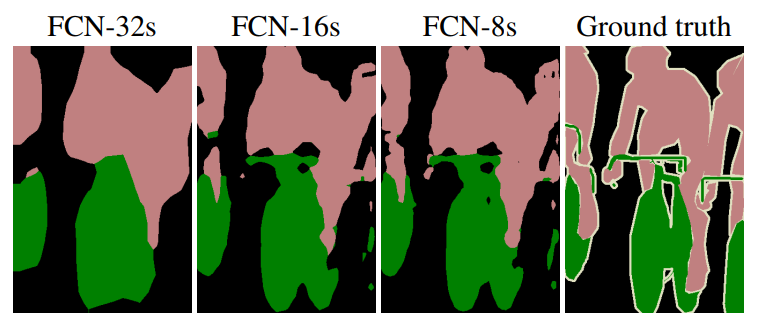
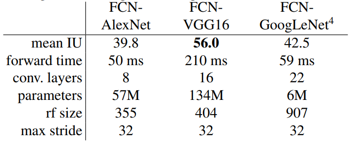

##  相关链接

### paper/github

Paper：https://arxiv.org/abs/1411.4038  

GitHub：https://github.com/shelhamer/fcn.berkeleyvision.org  

### 参考

https://mp.weixin.qq.com/s?__biz=MzA3NDIyMjM1NA==&mid=2649032209&idx=2&sn=ee63ef7fc1ac163cea8277b9a1dcaf84&chksm=8712b86cb065317aa4a79c774614965318a95333952ef31d9b6aaddfae0666d714bc0026cb8f&scene=21#wechat_redirect

https://zhuanlan.zhihu.com/p/31428783

## 概述

### 图像分割概念

分割：把一个完整的东西按照某种方式或规则分成若干个部分  

图像分割：把图像中属于同一类或者或者同一个体的东西划分到一起，并将各个子部分区分开来。

### 图像分割细分场景

1. 语义分割（semantic segmentation）：只区别类别，只有一个标签
2. 实例分割（instance segmentation）：区分相同类别的不同个体，只能分辨可数目标
3. 全景分割（panoptic segmentation）：同时实现实例分割和不可数类别的语义分割

## 摘要

1. FCN是一个像素级的分类模型，且可以接受任意尺寸的输入图像，将传统的CNN结构中最后的全连接层替换为卷积层，这样就可以得到2维的feature map，之后再通过softmax获得每个像素点的分类，从而解决了分割问题；
2. 利用VGGnet，GoogleNet，AlexNet等网络结构并fine-tuning，首次将图像分类网络转换成图像分割网络结构，使得网络可以支持像素级的稠密估计，并证明了再分割问题上可以实现端到端的训练；
3. 是深度学习方法解决分割问题的基石，在2012年PASCAL数据集上取得了state-of-art的结果。

## 模型分析

### 输入输出结构

输入：整幅图像

输出： 空间尺寸与输入图像相同，通道数等于全部类别数

真值：通道数为1（或2）的分割图像

### 全连接层 -> 卷积层

转换的优势：

1. 可以使网络用户稠密估计任务，并实现端到端训练。卷积层可以输出一个热度图heatmap，而非单个类别标签;
2. 通过接受整幅图像作为输入，而非以图块的形式处理图片，网络在处理速度上也有了明显提升。

### 整体网络结构

1. image经过多个conv和+一个max pooling变为pool1 feature，宽高变为1/2
2. pool1 feature再经过多个conv+一个max pooling变为pool2 feature，宽高变为1/4
3. pool2 feature再经过多个conv+一个max pooling变为pool3 feature，宽高变为1/8
4. ......
5. 直到pool5 feature，宽高变为1/32。

### 连接不同尺度下的层

分类网络通畅会通过设置步长的方式逐渐减小每层的空间尺寸，该方式可以同时实现计算量的缩小和信息的浓缩。

尽管该操作对于分类任务是很有效的，但是对于分割这样需要稠密估计的任务，浓缩未必是件好事。

解决方案：

将不同全局步长下的层之间进行连接，连接方式如下所示：

1. 对于FCN-32s，直接对pool5 feature进行32倍上采样获得32x upsampled feature，再对32x upsampled feature每个点做softmax prediction获得32x upsampled feature prediction（即分割图）。
2. 对于FCN-16s，首先对pool5 feature进行2倍上采样获得2x upsampled feature，再把pool4 feature和2x upsampled feature**逐点相加**，然后对相加的feature进行16倍上采样，并softmax prediction，获得16x upsampled feature prediction。
3. 对于FCN-8s，首先进行pool4+2x upsampled feature**逐点相加**，然后又进行pool3+2x upsampled**逐点相加**，即进行更多次特征融合。具体过程与16s类似，不再赘述。

结论：

随着细节信息的逐渐加入，分割的效果也越来越好，如下图全局步长32，全局步长16，全局步长8下的结果，最右是真值。  

### 上采样

上采样（upsampling）区别于下采样（downsampling），一般包括2中方式：

1. resize，如：双线性差值直接缩放，类似于图像缩放
2. deconvolution，也叫transposed convolution，反卷积

传统的网络是下采样的，可以将对应的输出尺寸降低；  

上采样的意义在于将小尺寸的高维度feature map恢复回去，以便于做pixelwise prediction，获得每个点的分类信息。  

更多卷积方式参考：https://github.com/vdumoulin/conv_arithmetic

### 模型指标与效果

#### 对比3中特征提取网络

可见，虽然VGG16的推理是件远高于其他两个网络，但是效果也明显好于两者。

## 总结思考

FCN意义重大，在当时来看效果相当惊人，带领图像分割任务进入深度学习时代，但是其本身也存在一些局限，如：  

1. 没有考虑全局信息
2. 无法解决实例分割问题
3. 速度远不能达到实时
4. 不能应对3D点云等不定性数据

