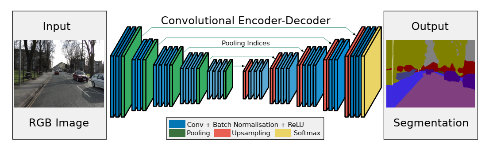
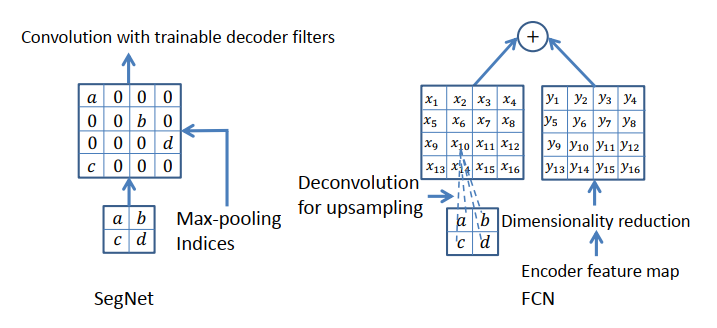

## 相关链接

### paper/github

paper：https://mp.weixin.qq.com/s/YwmHiQ0vyFAx_dhjsmOlAQ

github：https://github.com/alexgkendall/caffe-segnet

### 参考链接

1. https://mp.weixin.qq.com/s/YwmHiQ0vyFAx_dhjsmOlAQ
2. ·

## 摘要

SegNet发表于2015年，也是一个基于全卷积网络结构的算法，主要特点包括：

1. 首次提出编码-解码结构，编码用于输入图像的特征提取，解码用于像素级的分类；
2.  解码器在上采样过程中使用了编码阶段池化层的位置索引，可以实现对上采样的可训练估计；
3. 与FCN网络相比，其解码方式大大减少了权重参数，且加入batch normlization层之后明显改善了语义分割的效果。

## 模型分析

### 模型整体结构

SegNet模型结构对称，实现端到端的像素级图像分割。

### 解码方式解读

文中提到，图像分割网络中的编码，解码结构中，其编码结构大多都很类似，使用VGG等基础网络作为特征提取，效果相差不大，而解码器则影响着整个分割网络的效果，因此作者也对比了不同的解码方式下分割的效果，以下着重介绍SegNet中使用的解码方式，即利用编码阶段max pooling中的max indics 信息进行解码，达到上采样的目标。  

下图是SegNet中的解码方式与FCN中的对比，可以发现参数量大大减少。

说明：

1. 首先利用max-pooling 记录的max indices信息，将特征图上采样，该过程不需要学习；
2. 通过对上采样后的特征图进行卷积，得到该步解码操作最终的特征图，filters可学习

### 解码器变体

关于变体的分析，可以总结为以下三点：

- 保留编码器所有特征图所实现的效果最好，在这一点上语义分割边缘轮廓描述度量（BF）体现最为明显。
- 当推理过程的内存受限时，可以使用编码器特征图的压缩形式（比如缩小维度、使用池化信息等），但需要搭配合适的解码器形式（比如SegNet类型的）来提升表现。
- 在给定编码器时，越大的解码器效果越好。

### 内存和推断时间

SegNet比FCN和DeepLabv1慢，因为SegNet包含解码器架构。它比DeconvNet更快，因为它没有全连接层。

SegNet在训练和测试期间的内存要求都很低。并且模型尺寸比FCN和DeconvNet小得多。